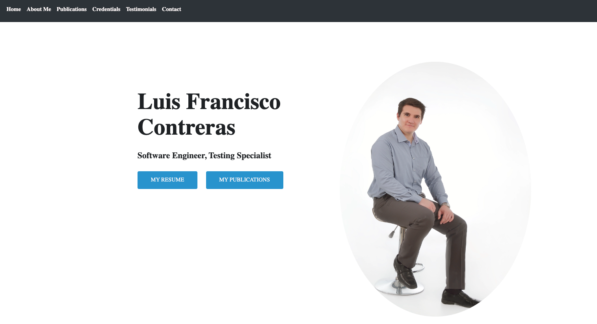

# My Portfolio.

This is my professional porfolio which contains my information and links to my different data such as my GitHub page, my Linkedin profile, my resume to view online or download if required, this information is contained on the home/index page.
On the Navbar and in the content of the page there are buttons to navigate to the projects page and credentials page.

On Publications page you will find Links and information regarding some publications I have done collaborating with ISQI SQ_Mag, https://www.sq-mag.com/

On the credentials page you will find all my professional certifications and courses where you can see some of my achievements with an option to filter them.

All pages have working links to different sections and pages to make it a positive experience for the viewer to interact with it, as well as been Responsive which is good to make sure this ensures that web applications render well on a variety of devices and window or screen sizes.

Link to GitHub pages: https://luiscontrerasglz.github.io/portfolio/

